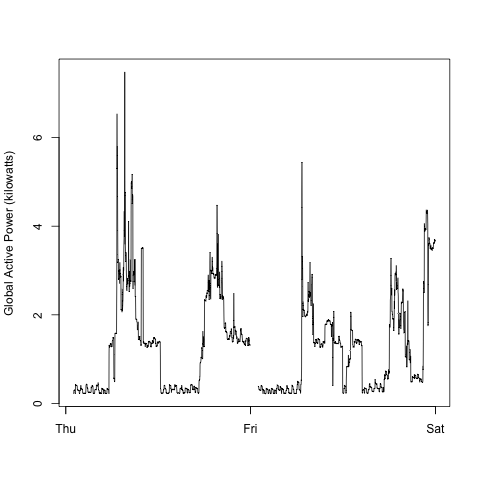
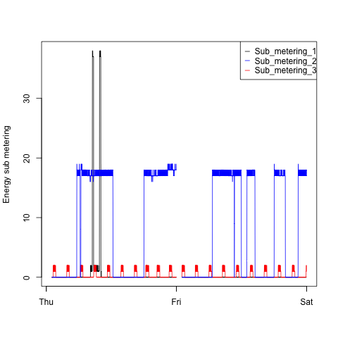
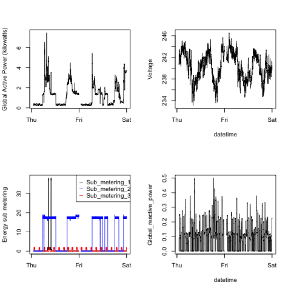

## Introduction

This document describes the overall data manipulation and plotting made to fulfill the Course Project 1 of Coursera __Exploratory Data Analysis__ (my 3rd course in the Data Science Specialization).

The overall goals of this project are:    
* to examine how household energy usage varies over a 2-day period in February, 2007. See data [here]("https://d396qusza40orc.cloudfront.net/exdata%2Fdata%2Fhousehold_power_consumption.zip") 
* and to reconstruct the given plots constructed using the base plotting system 

The original assignement can be found [here](https://github.com/rdpeng/ExData_Plotting1/blob/master/README.md)

> Important: the code uses the __{lubridate}__ package. Ensure the package is installed.  
> Important (2) : the UCI data set download uses a MaCOS __method = curl__. Please drop it if you are on Windows (see prepareData.R). 

Note: This document has been generated from a Rmarkdown document.

## File Organization
The repository contains the following files:
* README.md: this file. It has been generated from a Rmarkdown document
* prepareData.R: this file contains the code that get and clean data. Every plot generation code uses it to load data.
* For Plot1: plot1.R the code that generates plot1.png the resulting graphics
* For Plot2: plot2.R the code that generates plot2.png the resulting graphics
* For Plot3: plot3.R the code that generates plot3.png the resulting graphics
* For Plot4: plot1.R the code that generates plot4.png the resulting graphics
 

## Init process 

```r
## Init process: clean environment
rm(list = ls())
setwd(getwd())
```
## Loading the data set

### Raw estimation

```r
## Rough estimation:
## We have 9 variables with 2 string variables and 7 double variables -- I choose 'double' for a pessimistic calculation:

## - 2 types of string variables: length(dd/mm/yyyy) = 10 and length(hh:mm:ss) = 8"
## - Double variables takes a size of 8 bytes each 

## Taking the mean memory size 
avg_mem_size <- mean(c(8, 8, 10))

## or avg_em_size <- weighted.mean(c(8, 8, 10), c(7, 1, 1))

## We can thus estimate roughly the needed memory
rough_est <- (2075259 * 9 * avg_mem_size)/(1024^2)
print(paste("Rough estimation of memory needed:", rough_est, "MB"))
```

```
## [1] "Rough estimation of memory needed: 154.371454238892 MB"
```

### Loading the data

```r
## First program: load all by downloading the zip, unzip it and fetch data
loadAll <- function(link){
        download.file(link, "temp.zip", method = "curl")
        dldate <- date()
        writeLines(dldate, "downloadedat.txt")
        filepath <- unzip("temp.zip")
        dset <- read.csv(file = filepath, sep = ";", na.strings = "?") 
        file.remove("temp.zip")
        return(dset)
}
link <- "https://d396qusza40orc.cloudfront.net/exdata%2Fdata%2Fhousehold_power_consumption.zip"
df <- loadAll(link)
```
### Refactoring the loading function
 
```r
loadAll2 <- function(link){
        download.file(link, "temp.zip", method  = "curl")
        dldate <- date()
        print(paste("Data set is downloaded on:", dldate))
        writeLines(dldate, "downloadedat.txt")
        dset <- read.csv(unz(description="temp.zip", filename = "household_power_consumption.txt"), sep = ";", na.strings = "?")
        message("===> Data set is sucessfully loaded with :")
        message(paste("===> Number of observations:", nrow(dset)))
        message(paste("===> Number of variables:", ncol(dset)))
        file.remove("temp.zip")
        return(dset)
}
link <- "https://d396qusza40orc.cloudfront.net/exdata%2Fdata%2Fhousehold_power_consumption.zip"
df <- loadAll2(link)
```

```
## [1] "Data set is downloaded on: Thu Jul  9 00:17:44 2015"
```

```
## ===> Data set is sucessfully loaded with :
## ===> Number of observations: 2075259
## ===> Number of variables: 9
```

## Some cleaning (format date and time)

```r
library(lubridate)
## formatting the date
df$Date <- dmy(df$Date)
## formating the time
df$Time <- hms(df$Time)
```

## Subsetting to get the data we really needed

```r
## subsetting range (2007-02-01 - 2007-02-02)
realdf <- subset(df, Date >= ymd("2007-02-01") & Date <= ymd("2007-02-02"))

## engineer a new feature for date time. Will be used for plotting
realdf$datetime<- ymd_hms(paste(realdf$Date, realdf$Time))
```

```
## Warning: 120 failed to parse.
```
## Constructing the plots

### Plot 1

```r
## Build and show the plot
with(realdf, hist(Global_active_power, main = "Global Active Power", xlab = "Global Active Power (kilowatts)", col = "red"))
```

 

```r
## Export Plot 1 in .png
dev.copy(device = png, filename = "plot1.png", width = 480, height = 480)
```


```r
dev.off()
```

### Plot 2


```r
## Build and show the plot
with(realdf, plot(datetime, Global_active_power, type ="l", xlab = "", ylab = "Global Active Power (kilowatts)"))
```

 

```r
## export Plot 2 in png
dev.copy(device = png, filename = "plot2.png", width = 480, height = 480)
```


```r
dev.off()
```

### Plot 3

```r
## Build and show the plot
with(realdf, plot(datetime, Sub_metering_1, type="l", xlab="", ylab="Energy sub metering"))
with(realdf, lines(datetime, Sub_metering_2, col ="red"))
with(realdf, lines(datetime, Sub_metering_3, col ="blue", xlab="", ylab=""))
legend("topright", pch = "___", col = c("black", "blue", "red"), legend = c("Sub_metering_1", "Sub_metering_2", "Sub_metering_3"))
```

 

```r
# export plot 3 in png
dev.copy(device = png, filename = "plot3.png", width = 480, height = 480)
```


```r
dev.off()
```


```r
## Plot 4
op <- par(mfrow = c(2, 2))
## plot at row (1, 1)
with(realdf, plot(datetime, Global_active_power, type ="l", xlab = "", ylab = "Global Active Power (kilowatts)"))
## plot at row (1, 2)
with(realdf, plot(datetime, Voltage, xlab="datetime", ylab = "Voltage", type = "l"))

## plot at row (2, 1)
with(realdf, plot(datetime, Sub_metering_1, type="l", xlab="", ylab="Energy sub metering"))
with(realdf, lines(datetime, Sub_metering_2, col ="red"))
with(realdf, lines(datetime, Sub_metering_3, col ="blue", xlab="", ylab=""))
legend("topright", pch = "___", col = c("black", "blue", "red"), legend = c("Sub_metering_1", "Sub_metering_2", "Sub_metering_3"))

##plot at row (2, 2)
with(realdf, plot(datetime, Global_reactive_power, type = "l"))
```

 

```r
par(op) # reset graphical parameters
# export plot 4 in png
dev.copy(device = png, filename = "plot4.png", width = 480, height = 480)
```

```r
dev.off()
```

